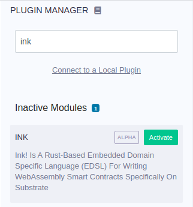
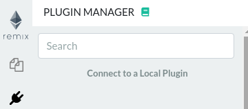
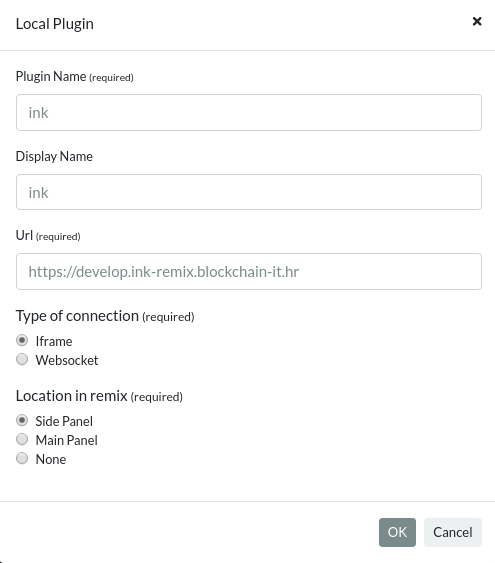
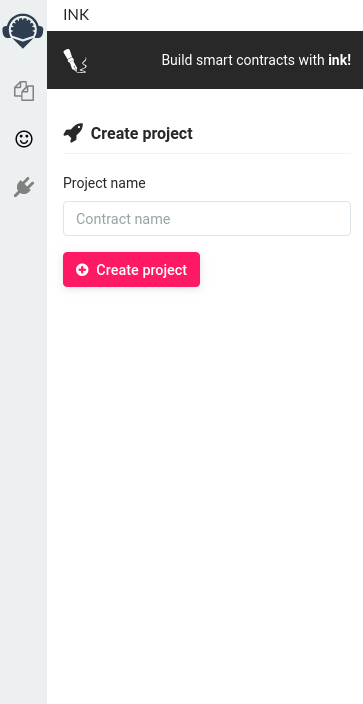
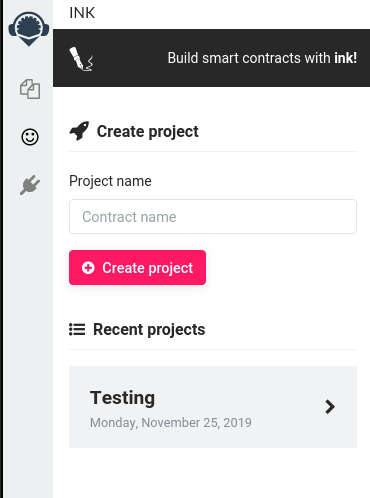
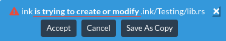
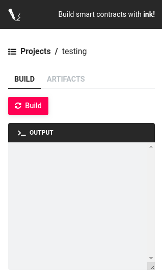
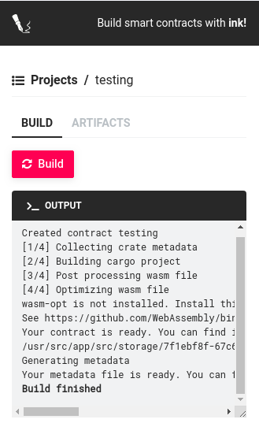
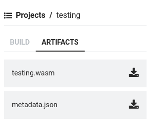

Welcome to the ink! Remix plugin.
For more info on the ink! join us on [chat](https://riot.im/app/#/room/#ink:matrix.parity.io)

## Support

  

## Structure

There are several folders:
* .github -> CI configuration for Github Actions
* config -> configuration for environment for specific stage
* kubernetes -> kubernetes helm templates for staging and production environments
* plugin -> frontend (Remix plugin part that is used inside Remix)
* scripts -> folder with helpers scripts that are used with CI or are helpers for working with GKE
* server -> backend (Remix backend part with ink! cli that is run locally or on server)
* static -> Images for this README
* stress_test -> folder for running scripts that benchmark system

Bigger folders have their own READMEs with more detailed description.

## How to use

If you want to just activate and use ink plugin, go to [Remix alpha](https://remix-alpha.ethereum.org/).  
Search for "ink" in the *Plugin manager* and click on *Activate*.

  

Or, if you want to use the development version, go to either [Remix alpha](https://remix-alpha.ethereum.org/) or [Remix](https://remix.ethereum.org/)
and then to *Plugin manager*.

Then in the *Plugin manager* click on *Connect to a Local Plugin*.

  

You can set *Plugin Name* and *Display Name* to any string.  
Url is: 
* <https://develop.ink-remix.blockchain-it.hr> for development
* <https://staging.ink-remix.blockchain-it.hr> for staging  
* <https://https://ink-remix.blockchain-it.hr> for production  
Click ok.

  

You should have now clean loaded ink.  
Accept any permissions that Remix is asking of you.

  

Next step is to create a project.  
Input *project/contract name* and click on *Create project*.

  

There will be a couple of permission screens, accept them all. :)

  

Next click on *Testing*. It will open a screen like on the next image.

  

Click on the *Build* button. As building progresses you will see logs from the backend building logs in real-time.  

Your log should look something like this after a successful build.  

  

Congratulations you’ve managed to create and build your first ink! project. :)  
Now, you can select tab *ARTIFACTS* above output window which will give you the option to download generated *testing.wasm* and *metadata.json* files using buttons on the right side.

  

Feel free to change the project and update the code and build it again, create a new project or anything else.

## Possible upgrades in the future

* Package whole project into tar/zip so it can be extracted and used elsewhere
* Integrating version control into the flow (git add, commit, push)
* Add dependency caching for faster build times

If you want to propose a feature or request, please open an issue or make a pull request

## Important links

* Code is located on [link](https://github.com/blockchain-it-hr/ink-remix-plugin)

* Docker images are on Docker Hub:
  * [ink-plugin](https://hub.docker.com/repository/docker/blockchainit/ink-plugin)
  * [ink-server](https://hub.docker.com/repository/docker/blockchainit/ink-server)

## How to run

To run locally using docker-compose use:

`docker-compose up`

Feel free to change docker-compose.yml and play with it.
